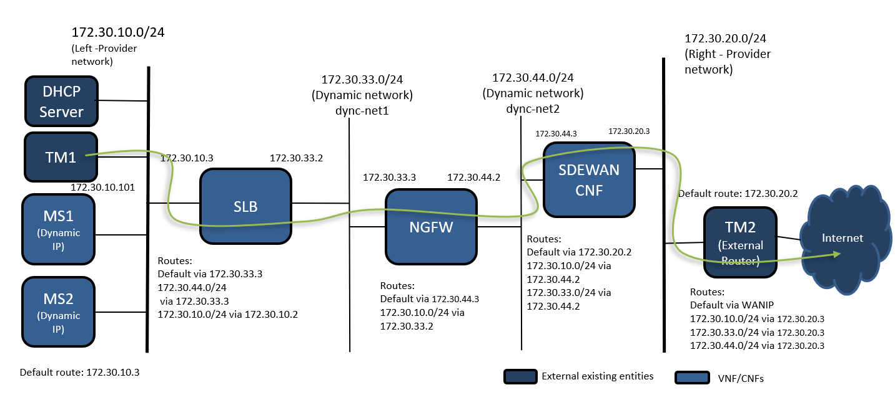
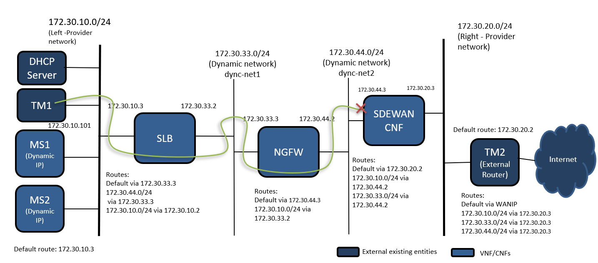
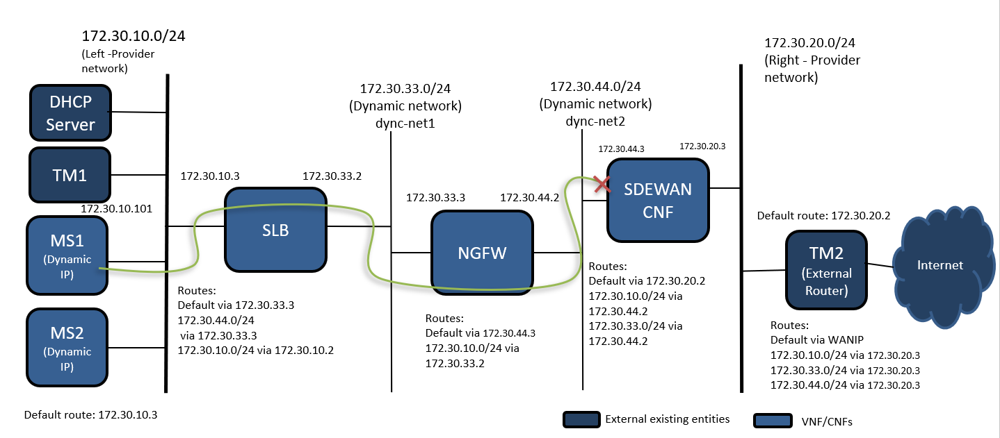

# Service Function Chaining(SFC) - setup

## Summary

This project offers a means for deploying a Kubernetes cluster
that satisfies the requirements of ovn4nfv sfc-setup

## Virtual Machines

This project uses [Vagrant tool][2] for provisioning Virtual Machines
automatically. The [setup](setup.sh) bash script contains the
Linux instructions to install dependencies and plugins required for
its usage. This script supports two Virtualization technologies
(Libvirt and VirtualBox).

```
    $ sudo ./setup.sh -p libvirt
```
There is a `default.yml` in the `./config` directory which creates multiple vm.

Once Vagrant is installed, it's possible to provision a vm using
the following instructions:
```
    $ vagrant up
```
In-depth documentation and use cases of various Vagrant commands [Vagrant commands][3]
is available on the Vagrant site.

## Deployment

### kubeadm

Install the [docker](https://docs.docker.com/engine/install/ubuntu/) in the master, minion01 and minion02 vm.
Follow the steps in [create cluster kubeadm](https://kubernetes.io/docs/setup/production-environment/tools/kubeadm/create-cluster-kubeadm/) to create kubernetes cluster in master
In the master vm run the `kubeadm init` as below. The ovn4nfv uses same pod network cidr `10.233.64.0/18`
```
    $ kubeadm init --kubernetes-version=1.19.0 --pod-network-cidr=10.233.64.0/18 --apiserver-advertise-address=<master_eth0_ip_address>
```
Deploy the ovn4nfv Pod network to the cluster.
```
    $ kubectl apply -f ovn4nfv-pod-network/ovn-daemonset.yaml
    $ kubectl apply -f ovn4nfv-pod-network/ovn4nfv-k8s-plugin.yaml
```
Join minion01 and minion02 by running the `kubeadm join` on each node as root as mentioned in [create cluster kubeadm](https://kubernetes.io/docs/setup/production-environment/tools/kubeadm/create-cluster-kubeadm/)

### TM1 server

ssh into the TM1 vm and run the following command to attach TM1 to the left provider network.
```
    $ ip addr flush dev eth1
    $ ip link add link eth1 name eth1.100 type vlan id 100
    $ ip link set dev eth1.100 up
    $ ip addr add 172.30.10.101/24 dev eth1.100
    $ ip route del default
    $ ip route add default via 172.30.10.3
```
### TM2 server

ssh into the TM2 vm and run the following command to attach TM2 to the right provider network.
```
    $ ip addr flush dev eth1
    $ ip link add link eth1 name eth1.200 type vlan id 200
    $ ip link set dev eth1.200 up
    $ ip addr add 172.30.20.2/24 dev eth1.200
```
Run the following commands to create virutal router
```
   $ ip route add 172.30.10.0/24 via 172.30.20.3
   $ ip route add 172.30.33.0/24 via 172.30.20.3
   $ ip route add 172.30.44.0/24 via 172.30.20.3
```
```
   $ echo 1 > /proc/sys/net/ipv4/ip_forward
   $ /sbin/iptables -t nat -A POSTROUTING -o eth0 -j MASQUERADE
   $ iptables -A FORWARD -i eth1 -o eth0 -j ACCEPT
   $ iptables -A FORWARD -i eth1.200 -o eth0 -j ACCEPT
```
## Demo

Deploy the SDEWAN controller in cluster
```
   $ git clone https://github.com/akraino-edge-stack/icn-sdwan.git
   $ cd icn-sdwan/platform/crd-ctrlr
   $ kubectl apply -f https://github.com/jetstack/cert-manager/releases/download/v0.11.0/cert-manager.yaml --validate=false
   $ kubectl apply -f examples/sdewan-controller.yaml
```
From TM1 try to ping google.com, the ping operation will fails.

Deploy the SFC as following
```
   $ kubectl apply -f demo/sfc-setup/deploy/sfc-network.yaml
   $ kubectl apply -f demo/sfc-setup/deploy/slb-ngfw-sdewan-cnf-deployment.yaml
   $ kubectl apply -f demo/sfc-setup/deploy/ms1.yaml
```
## Test Scenario - to comprehend multiple deployment variations


This show the test scenario we created in this demo.

Pinging for goole.com or curl example.com should fail in both ms1 and TM1
```
   $ kubectl apply -f demo/sfc-setup/deploy/sfc.yaml
```
Pinging for google.com or curl example.com should be successful in both ms1 and TM1

## Traffic from external entities with sfc


## Traffic from pod within the cluster with sfc


Let try to apply icmp reject rule in SDEWAN cnf
```
   $ kubectl apply -f demo/sfc-setup/deploy/firewall-dyn-net-2.yaml
   $ kubectl apply -f demo/sfc-setup/deploy/firewall-right-pnetwork.yaml
   $ kubectl apply -f demo/sfc-setup/deploy/firewall-rule-reject-icmp-right-pnetwork.yaml
```
## Traffic from external entities with sfc - SDEWAN icmp reject


## Traffic from pod within the cluster with sfc - SDEWAN icmp reject


Pinging for google.com will fail and curl example.com should be successful in both ms1 and TM1

## License

Apache-2.0

[1]: https://www.vagrantup.com/
[2]: https://www.vagrantup.com/docs/cli/
[3]: https://www.github.com/akraino-edge-stack/icn-sdwan
