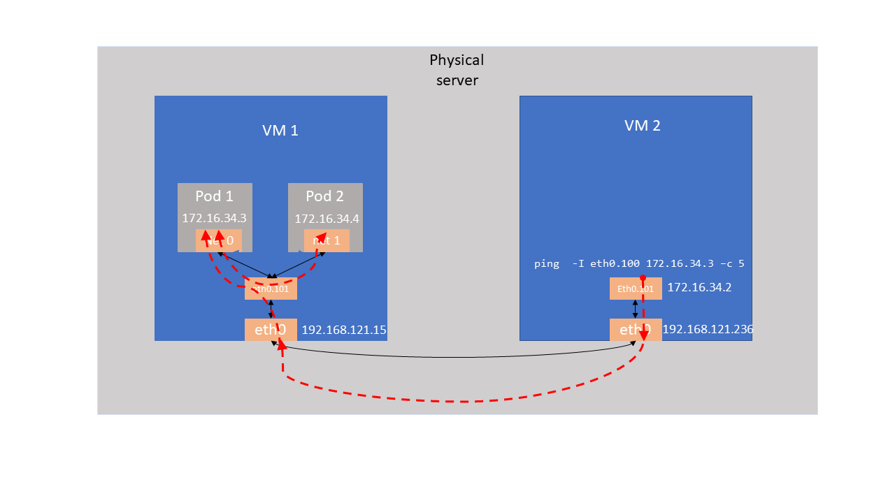

# OVN4NFV Usage guide

## Quickstart Installation Guide

Please follow the ovn4nfv installation steps - [ovn4nfv installation](https://github.com/ovn4nfv/ovn4nfv-k8s-plugin#quickstart-installation-guide)

## Network Testing

create 2 pod and test the ping operation between them

```
# kubectl apply -f example/ovn4nfv-deployment-replica-2-noannotation.yaml
deployment.apps/ovn4nfv-deployment-noannotation created
# kubectl get pods  -o wide
NAMESPACE     NAME                                              READY   STATUS    RESTARTS   AGE     IP               NODE       NOMINATED NODE   READINESS GATES
default       ovn4nfv-deployment-noannotation-f446688bf-8g8hl   1/1     Running   0          3m26s   10.233.64.11     minion02   <none>           <none>
default       ovn4nfv-deployment-noannotation-f446688bf-srh56   1/1     Running   0          3m26s   10.233.64.10     minion01   <none>           <none>
# kubectl exec -it ovn4nfv-deployment-noannotation-f446688bf-8g8hl -- ping 10.233.64.10 -c 1
PING 10.233.64.10 (10.233.64.10): 56 data bytes
64 bytes from 10.233.64.10: seq=0 ttl=64 time=2.650 ms

--- 10.233.64.10 ping statistics ---
1 packets transmitted, 1 packets received, 0% packet loss
round-trip min/avg/max = 2.650/2.650/2.650 ms
```

Create hostname deployment and svc and test the k8s service query

```
# kubectl apply -f example/ovn4nfv-deployment-noannotation-hostnames.yaml
deployment.apps/hostnames created
# kubectl get pods --all-namespaces -o wide
NAMESPACE     NAME                                          READY   STATUS    RESTARTS   AGE     IP               NODE       NOMINATED NODE   READINESS GATES
default       hostnames-5d97c4688-jqw77                     1/1     Running   0          12s     10.233.64.12     minion01   <none>           <none>
default       hostnames-5d97c4688-rx7zp                     1/1     Running   0          12s     10.233.64.11     master     <none>           <none>
default       hostnames-5d97c4688-z44sh                     1/1     Running   0          12s     10.233.64.10     minion02   <none>           <none>
```

Test the hostname svc

```
# kubectl apply -f example/ovn4nfv-deployment-hostnames-svc.yaml
service/hostnames created
# kubectl apply -f example/ovn4nfv-deployment-noannotation-sandbox.yaml
deployment.apps/ovn4nfv-deployment-noannotation-sandbox created
# kubectl get pods -o wide
NAME                                                       READY   STATUS    RESTARTS   AGE     IP             NODE       NOMINATED NODE   READINESS GATES
hostnames-5d97c4688-jqw77                                  1/1     Running   0          6m41s   10.233.64.12   minion01   <none>           <none>
hostnames-5d97c4688-rx7zp                                  1/1     Running   0          6m41s   10.233.64.11   master     <none>           <none>
hostnames-5d97c4688-z44sh                                  1/1     Running   0          6m41s   10.233.64.10   minion02   <none>           <none>
ovn4nfv-deployment-noannotation-sandbox-5fb94db669-vdkss   1/1     Running   0          9s      10.233.64.13   minion02   <none>           <none>
# kubectl exec -it ovn4nfv-deployment-noannotation-sandbox-5fb94db669-vdkss -- wget -qO- hostnames
hostnames-5d97c4688-jqw77
# kubectl exec -it ovn4nfv-deployment-noannotation-sandbox-5fb94db669-vdkss -- wget -qO- hostnames
hostnames-5d97c4688-rx7zp
# kubectl exec -it ovn4nfv-deployment-noannotation-sandbox-5fb94db669-vdkss -- wget -qO- hostnames
hostnames-5d97c4688-z44sh
```
you should get different hostname for each query

Test the reachablity

```
# kubectl exec -it ovn4nfv-deployment-noannotation-sandbox-5fb94db669-vdkss -- wget -qO- example.com
<!doctype html>
<html>
<head>
    <title>Example Domain</title>

    <meta charset="utf-8" />
    <meta http-equiv="Content-type" content="text/html; charset=utf-8" />
    <meta name="viewport" content="width=device-width, initial-scale=1" />
    <style type="text/css">
    body {
        background-color: #f0f0f2;
        margin: 0;
        padding: 0;
        font-family: -apple-system, system-ui, BlinkMacSystemFont, "Segoe UI", "Open Sans", "Helvetica Neue", Helvetica, Arial, sans-serif;

    }
    div {
        width: 600px;
        margin: 5em auto;
        padding: 2em;
        background-color: #fdfdff;
        border-radius: 0.5em;
        box-shadow: 2px 3px 7px 2px rgba(0,0,0,0.02);
    }
    a:link, a:visited {
        color: #38488f;
        text-decoration: none;
    }
    @media (max-width: 700px) {
        div {
            margin: 0 auto;
            width: auto;
        }
    }
    </style>
</head>

<body>
<div>
    <h1>Example Domain</h1>
    <p>This domain is for use in illustrative examples in documents. You may use this
    domain in literature without prior coordination or asking for permission.</p>
    <p><a href="https://www.iana.org/domains/example">More information...</a></p>
</div>
</body>
</html>
```

## Test the  Multiple Network Setup and Testing

Create two networks ovn-priv-net and ovn-port-net

```
# kubectl apply -f example/ovn-priv-net.yaml
network.k8s.plugin.opnfv.org/ovn-priv-net created

# kubectl apply -f example/ovn-port-net.yaml
network.k8s.plugin.opnfv.org/ovn-port-net created

# kubectl get crds
NAME                                    CREATED AT
networkchainings.k8s.plugin.opnfv.org   2020-09-21T19:29:50Z
networks.k8s.plugin.opnfv.org           2020-09-21T19:29:50Z
providernetworks.k8s.plugin.opnfv.org   2020-09-21T19:29:50

# kubectl get networks
NAME           AGE
ovn-port-net   32s
ovn-priv-net   39s
```

Use the network `ovn-port-net` and `ovn-priv-net` for the multiple network creation
and test the network connectivity between the pods

```
# kubectl apply -f example/ovn4nfv-deployment-replica-2-withannotation.yaml
deployment.apps/ovn4nfv-deployment-2-annotation created

# kubectl get pods -o wide
NAME                                               READY   STATUS    RESTARTS   AGE     IP             NODE       NOMINATED NODE   READINESS GATES
ovn4nfv-deployment-2-annotation-65cbc6f87f-5zwkt   1/1     Running   0          3m15s   10.233.64.14   minion01   <none>           <none>
ovn4nfv-deployment-2-annotation-65cbc6f87f-cv75p   1/1     Running   0          3m15s   10.233.64.15   minion02   <none>           <none>

# kubectl exec -it ovn4nfv-deployment-2-annotation-65cbc6f87f-5zwkt -- ifconfig
eth0      Link encap:Ethernet  HWaddr B6:66:62:E9:40:0F
          inet addr:10.233.64.14  Bcast:10.233.127.255  Mask:255.255.192.0
          UP BROADCAST RUNNING MULTICAST  MTU:1400  Metric:1
          RX packets:13 errors:0 dropped:0 overruns:0 frame:0
          TX packets:0 errors:0 dropped:0 overruns:0 carrier:0
          collisions:0 txqueuelen:0
          RX bytes:1026 (1.0 KiB)  TX bytes:0 (0.0 B)

lo        Link encap:Local Loopback
          inet addr:127.0.0.1  Mask:255.0.0.0
          UP LOOPBACK RUNNING  MTU:65536  Metric:1
          RX packets:0 errors:0 dropped:0 overruns:0 frame:0
          TX packets:0 errors:0 dropped:0 overruns:0 carrier:0
          collisions:0 txqueuelen:1000
          RX bytes:0 (0.0 B)  TX bytes:0 (0.0 B)

net0      Link encap:Ethernet  HWaddr B6:66:62:10:21:03
          inet addr:172.16.33.2  Bcast:172.16.33.255  Mask:255.255.255.0
          UP BROADCAST RUNNING MULTICAST  MTU:1400  Metric:1
          RX packets:13 errors:0 dropped:0 overruns:0 frame:0
          TX packets:0 errors:0 dropped:0 overruns:0 carrier:0
          collisions:0 txqueuelen:0
          RX bytes:1026 (1.0 KiB)  TX bytes:0 (0.0 B)

net1      Link encap:Ethernet  HWaddr B6:66:62:10:2C:03
          inet addr:172.16.44.2  Bcast:172.16.44.255  Mask:255.255.255.0
          UP BROADCAST RUNNING MULTICAST  MTU:1400  Metric:1
          RX packets:52 errors:0 dropped:0 overruns:0 frame:0
          TX packets:0 errors:0 dropped:0 overruns:0 carrier:0
          collisions:0 txqueuelen:0
          RX bytes:10452 (10.2 KiB)  TX bytes:0 (0.0 B)

# kubectl exec -it ovn4nfv-deployment-2-annotation-65cbc6f87f-cv75p -- ifconfig
eth0      Link encap:Ethernet  HWaddr B6:66:62:E9:40:10
          inet addr:10.233.64.15  Bcast:10.233.127.255  Mask:255.255.192.0
          UP BROADCAST RUNNING MULTICAST  MTU:1400  Metric:1
          RX packets:13 errors:0 dropped:0 overruns:0 frame:0
          TX packets:0 errors:0 dropped:0 overruns:0 carrier:0
          collisions:0 txqueuelen:0
          RX bytes:1026 (1.0 KiB)  TX bytes:0 (0.0 B)

lo        Link encap:Local Loopback
          inet addr:127.0.0.1  Mask:255.0.0.0
          UP LOOPBACK RUNNING  MTU:65536  Metric:1
          RX packets:0 errors:0 dropped:0 overruns:0 frame:0
          TX packets:0 errors:0 dropped:0 overruns:0 carrier:0
          collisions:0 txqueuelen:1000
          RX bytes:0 (0.0 B)  TX bytes:0 (0.0 B)

net0      Link encap:Ethernet  HWaddr B6:66:62:10:21:04
          inet addr:172.16.33.3  Bcast:172.16.33.255  Mask:255.255.255.0
          UP BROADCAST RUNNING MULTICAST  MTU:1400  Metric:1
          RX packets:13 errors:0 dropped:0 overruns:0 frame:0
          TX packets:0 errors:0 dropped:0 overruns:0 carrier:0
          collisions:0 txqueuelen:0
          RX bytes:1026 (1.0 KiB)  TX bytes:0 (0.0 B)

net1      Link encap:Ethernet  HWaddr B6:66:62:10:2C:04
          inet addr:172.16.44.3  Bcast:172.16.44.255  Mask:255.255.255.0
          UP BROADCAST RUNNING MULTICAST  MTU:1400  Metric:1
          RX packets:13 errors:0 dropped:0 overruns:0 frame:0
          TX packets:0 errors:0 dropped:0 overruns:0 carrier:0
          collisions:0 txqueuelen:0
          RX bytes:1026 (1.0 KiB)  TX bytes:0 (0.0 B)

# kubectl exec -it ovn4nfv-deployment-2-annotation-65cbc6f87f-cv75p -- ping 172.16.44.2 -c 1
PING 172.16.44.2 (172.16.44.2): 56 data bytes
64 bytes from 172.16.44.2: seq=0 ttl=64 time=3.488 ms

--- 172.16.44.2 ping statistics ---
1 packets transmitted, 1 packets received, 0% packet loss
round-trip min/avg/max = 3.488/3.488/3.488 ms
```

## VLAN and Direct Provider Network Setup and Testing

In this `./example` folder, OVN4NFV-plugin daemonset yaml file, VLAN and direct Provider networking testing scenarios and required sample
configuration file.

### Quick start

### Creating sandbox environment

Create 2 VMs in your setup. The recommended way of creating the sandbox is through KUD. Please follow the all-in-one setup in KUD. This
will create two VMs and provide the required sandbox.

### VLAN Tagging Provider network testing

The following setup have 2 VMs with one VM having Kubernetes setup with OVN4NFVk8s plugin and another VM act as provider networking to do
testing.

Run the following yaml file to test teh vlan tagging provider networking. User required to change the `providerInterfaceName` and
`nodeLabelList` in the `ovn4nfv_vlan_pn.yml`

```
kubectl apply -f ovn4nfv_vlan_pn.yml
```
This create Vlan tagging interface eth0.100 in VM1 and two pods for the deployment `pnw-original-vlan-1` and `pnw-original-vlan-2` in VM.
Test the interface details and inter network communication between `net0` interfaces
```
# kubectl exec -it pnw-original-vlan-1-6c67574cd7-mv57g -- ifconfig
eth0      Link encap:Ethernet  HWaddr 0A:58:0A:F4:40:30
          inet addr:10.244.64.48  Bcast:0.0.0.0  Mask:255.255.255.0
          UP BROADCAST RUNNING MULTICAST  MTU:1450  Metric:1
          RX packets:11 errors:0 dropped:0 overruns:0 frame:0
          TX packets:0 errors:0 dropped:0 overruns:0 carrier:0
          collisions:0 txqueuelen:0
          RX bytes:462 (462.0 B)  TX bytes:0 (0.0 B)

lo        Link encap:Local Loopback
          inet addr:127.0.0.1  Mask:255.0.0.0
          UP LOOPBACK RUNNING  MTU:65536  Metric:1
          RX packets:0 errors:0 dropped:0 overruns:0 frame:0
          TX packets:0 errors:0 dropped:0 overruns:0 carrier:0
          collisions:0 txqueuelen:1000
          RX bytes:0 (0.0 B)  TX bytes:0 (0.0 B)

net0      Link encap:Ethernet  HWaddr 0A:00:00:00:00:3C
          inet addr:172.16.33.3  Bcast:172.16.33.255  Mask:255.255.255.0
          UP BROADCAST RUNNING MULTICAST  MTU:1400  Metric:1
          RX packets:10 errors:0 dropped:0 overruns:0 frame:0
          TX packets:9 errors:0 dropped:0 overruns:0 carrier:0
          collisions:0 txqueuelen:0
          RX bytes:868 (868.0 B)  TX bytes:826 (826.0 B)
# kubectl exec -it pnw-original-vlan-2-5bd9ffbf5c-4gcgq -- ifconfig
eth0      Link encap:Ethernet  HWaddr 0A:58:0A:F4:40:31
          inet addr:10.244.64.49  Bcast:0.0.0.0  Mask:255.255.255.0
          UP BROADCAST RUNNING MULTICAST  MTU:1450  Metric:1
          RX packets:11 errors:0 dropped:0 overruns:0 frame:0
          TX packets:0 errors:0 dropped:0 overruns:0 carrier:0
          collisions:0 txqueuelen:0
          RX bytes:462 (462.0 B)  TX bytes:0 (0.0 B)

lo        Link encap:Local Loopback
          inet addr:127.0.0.1  Mask:255.0.0.0
          UP LOOPBACK RUNNING  MTU:65536  Metric:1
          RX packets:0 errors:0 dropped:0 overruns:0 frame:0
          TX packets:0 errors:0 dropped:0 overruns:0 carrier:0
          collisions:0 txqueuelen:1000
          RX bytes:0 (0.0 B)  TX bytes:0 (0.0 B)

net0      Link encap:Ethernet  HWaddr 0A:00:00:00:00:3D
          inet addr:172.16.33.4  Bcast:172.16.33.255  Mask:255.255.255.0
          UP BROADCAST RUNNING MULTICAST  MTU:1400  Metric:1
          RX packets:25 errors:0 dropped:0 overruns:0 frame:0
          TX packets:25 errors:0 dropped:0 overruns:0 carrier:0
          collisions:0 txqueuelen:0
          RX bytes:2282 (2.2 KiB)  TX bytes:2282 (2.2 KiB)
```
Test the ping operation between the vlan interfaces
```
# kubectl exec -it pnw-original-vlan-2-5bd9ffbf5c-4gcgq -- ping -I net0 172.16.33.3 -c 2
PING 172.16.33.3 (172.16.33.3): 56 data bytes
64 bytes from 172.16.33.3: seq=0 ttl=64 time=0.092 ms
64 bytes from 172.16.33.3: seq=1 ttl=64 time=0.105 ms

--- 172.16.33.3 ping statistics ---
2 packets transmitted, 2 packets received, 0% packet loss
round-trip min/avg/max = 0.092/0.098/0.105 ms
```
In VM2 create a Vlan tagging for eth0 as eth0.100 and configure the IP address as
```
# ifconfig eth0.100
eth0.100: flags=4163<UP,BROADCAST,RUNNING,MULTICAST>  mtu 1500
        inet 172.16.33.2  netmask 255.255.255.0  broadcast 172.16.33.255
        ether 52:54:00:f4:ee:d9  txqueuelen 1000  (Ethernet)
        RX packets 111  bytes 8092 (8.0 KB)
        RX errors 0  dropped 0  overruns 0  frame 0
        TX packets 149  bytes 12698 (12.6 KB)
        TX errors 0  dropped 0 overruns 0  carrier 0  collisions 0
```
Pinging from VM2 through eth0.100 to pod 1 in VM1 should be successfull to test the VLAN tagging
```
# ping -I eth0.100 172.16.33.3 -c 2
PING 172.16.33.3 (172.16.33.3) from 172.16.33.2 eth0.100: 56(84) bytes of data.
64 bytes from 172.16.33.3: icmp_seq=1 ttl=64 time=0.382 ms
64 bytes from 172.16.33.3: icmp_seq=2 ttl=64 time=0.347 ms

--- 172.16.33.3 ping statistics ---
2 packets transmitted, 2 received, 0% packet loss, time 1009ms
rtt min/avg/max/mdev = 0.347/0.364/0.382/0.025 ms
```
### VLAN Tagging between VMs


### Direct Provider network testing

The main difference between Vlan tagging and Direct provider networking is that VLAN logical interface is created and then ports are
attached to it. In order to validate the direct provider networking connectivity, we create VLAN tagging between VM1 & VM2 and test the
connectivity as follow.

Create VLAN tagging interface eth0.101 in VM1 and VM2. Just add `providerInterfaceName: eth0.101' in Direct provider network CR.
```
# kubectl apply -f ovn4nfv_direct_pn.yml
```
Check the inter connection between direct provider network pods as follow
```
# kubectl exec -it pnw-original-direct-1-85f5b45fdd-qq6xc -- ifconfig
eth0      Link encap:Ethernet  HWaddr 0A:58:0A:F4:40:33
          inet addr:10.244.64.51  Bcast:0.0.0.0  Mask:255.255.255.0
          UP BROADCAST RUNNING MULTICAST  MTU:1450  Metric:1
          RX packets:6 errors:0 dropped:0 overruns:0 frame:0
          TX packets:0 errors:0 dropped:0 overruns:0 carrier:0
          collisions:0 txqueuelen:0
          RX bytes:252 (252.0 B)  TX bytes:0 (0.0 B)

lo        Link encap:Local Loopback
          inet addr:127.0.0.1  Mask:255.0.0.0
          UP LOOPBACK RUNNING  MTU:65536  Metric:1
          RX packets:0 errors:0 dropped:0 overruns:0 frame:0
          TX packets:0 errors:0 dropped:0 overruns:0 carrier:0
          collisions:0 txqueuelen:1000
          RX bytes:0 (0.0 B)  TX bytes:0 (0.0 B)

net0      Link encap:Ethernet  HWaddr 0A:00:00:00:00:3E
          inet addr:172.16.34.3  Bcast:172.16.34.255  Mask:255.255.255.0
          UP BROADCAST RUNNING MULTICAST  MTU:1400  Metric:1
          RX packets:29 errors:0 dropped:0 overruns:0 frame:0
          TX packets:26 errors:0 dropped:0 overruns:0 carrier:0
          collisions:0 txqueuelen:0
          RX bytes:2394 (2.3 KiB)  TX bytes:2268 (2.2 KiB)

# kubectl exec -it pnw-original-direct-2-6bc54d98c4-vhxmk  -- ifconfig
eth0      Link encap:Ethernet  HWaddr 0A:58:0A:F4:40:32
          inet addr:10.244.64.50  Bcast:0.0.0.0  Mask:255.255.255.0
          UP BROADCAST RUNNING MULTICAST  MTU:1450  Metric:1
          RX packets:6 errors:0 dropped:0 overruns:0 frame:0
          TX packets:0 errors:0 dropped:0 overruns:0 carrier:0
          collisions:0 txqueuelen:0
          RX bytes:252 (252.0 B)  TX bytes:0 (0.0 B)

lo        Link encap:Local Loopback
          inet addr:127.0.0.1  Mask:255.0.0.0
          UP LOOPBACK RUNNING  MTU:65536  Metric:1
          RX packets:0 errors:0 dropped:0 overruns:0 frame:0
          TX packets:0 errors:0 dropped:0 overruns:0 carrier:0
          collisions:0 txqueuelen:1000
          RX bytes:0 (0.0 B)  TX bytes:0 (0.0 B)

net0      Link encap:Ethernet  HWaddr 0A:00:00:00:00:3F
          inet addr:172.16.34.4  Bcast:172.16.34.255  Mask:255.255.255.0
          UP BROADCAST RUNNING MULTICAST  MTU:1400  Metric:1
          RX packets:14 errors:0 dropped:0 overruns:0 frame:0
          TX packets:10 errors:0 dropped:0 overruns:0 carrier:0
          collisions:0 txqueuelen:0
          RX bytes:1092 (1.0 KiB)  TX bytes:924 (924.0 B)
# kubectl exec -it pnw-original-direct-2-6bc54d98c4-vhxmk  -- ping -I net0 172.16.34.3 -c 2
PING 172.16.34.3 (172.16.34.3): 56 data bytes
64 bytes from 172.16.34.3: seq=0 ttl=64 time=0.097 ms
64 bytes from 172.16.34.3: seq=1 ttl=64 time=0.096 ms

--- 172.16.34.3 ping statistics ---
2 packets transmitted, 2 packets received, 0% packet loss
round-trip min/avg/max = 0.096/0.096/0.097 ms
```
In VM2, ping the pod1 in the VM1
$ ping -I eth0.101 172.16.34.2 -c 2
```
PING 172.16.34.2 (172.16.34.2) from 172.16.34.2 eth0.101: 56(84) bytes of data.
64 bytes from 172.16.34.2: icmp_seq=1 ttl=64 time=0.057 ms
64 bytes from 172.16.34.2: icmp_seq=2 ttl=64 time=0.065 ms

--- 172.16.34.2 ping statistics ---
2 packets transmitted, 2 received, 0% packet loss, time 1010ms
rtt min/avg/max/mdev = 0.057/0.061/0.065/0.004 ms
```
### Direct provider networking between VMs


## Testing with CNI Proxy
There are multi CNI Proxy plugins such as Multus, DAMN and CNI-Genie. In this testing, we are testing with Multus CNI and Calico CNI
### kubeadm
Install the [docker](https://docs.docker.com/engine/install/ubuntu/) in the Kubernetes cluster node.
Follow the steps in [create cluster kubeadm](https://kubernetes.io/docs/setup/production-environment/tools/kubeadm/create-cluster-kubeadm/) to create kubernetes cluster in master
In the master node run the `kubeadm init` as below. The calico uses pod network cidr `10.233.64.0/18`
```
    $ kubeadm init --kubernetes-version=1.19.0 --pod-network-cidr=10.233.64.0/18 --apiserver-advertise-address=<master_eth0_ip_address>
```
Ensure the master node taint for no schedule is removed and labelled with `ovn4nfv-k8s-plugin=ovn-control-plane`
```
nodename=$(kubectl get node -o jsonpath='{.items[0].metadata.name}')
kubectl taint node $nodename node-role.kubernetes.io/master:NoSchedule-
kubectl label --overwrite node $nodename ovn4nfv-k8s-plugin=ovn-control-plane
```
Deploy the Calico and Multus CNI in the kubeadm master
```
     $ kubectl apply -f deploy/calico.yaml
     $ kubectl apply -f deploy/multus-daemonset.yaml
```
Rename the `/opt/cni/net.d/70-multus.conf` to `/opt/cni/net.d/00-multus.conf` . There will be multiple conf files, we have to make sure Multus file is in the Lexicographic order.
Kubernetes kubelet is designed to pick the config file in the lexicograpchic order.

In this example, we are using pod CIDR as `10.233.64.0/18`. The Calico will automatically detect the CIDR based on the running configuration.
Since calico network going to the primary network in our case, ovn4nfv subnet should be a different network. Make sure you change the `OVN_SUBNET` and `OVN_GATEWAYIP` in `deploy/ovn4nfv-k8s-plugin.yaml`
In this example, we customize the ovn network as follows.
```
data:
  OVN_SUBNET: "10.154.142.0/18"
  OVN_GATEWAYIP: "10.154.142.1/18"
```
Deploy the ovn4nfv Pod network to the cluster.
```
    $ kubectl apply -f deploy/ovn-daemonset.yaml
    $ kubectl apply -f deploy/ovn4nfv-k8s-plugin.yaml
```
Join worker node by running the `kubeadm join` on each node as root as mentioned in [create cluster kubeadm](https://kubernetes.io/docs/setup/production-environment/tools/kubeadm/create-cluster-kubeadm/).
Also make sure to rename the the `/opt/cni/net.d/70-multus.conf` to `/opt/cni/net.d/00-multus.conf` in all nodes.

### Test the Multiple Network Setup with Multus
Create a network attachment definition as mentioned in the [multi-net-spec](https://github.com/k8snetworkplumbingwg/multi-net-spec)
```
# kubectl create -f example/multus-net-attach-def-cr.yaml
networkattachmentdefinition.k8s.cni.cncf.io/ovn4nfv-k8s-plugin created
# kubectl get net-attach-def
NAME                 AGE
ovn4nfv-k8s-plugin   9s
```

Let check the multiple interface created from OVN4NFV and Calico
```
# kubectl create -f example/ovn4nfv-deployment-with-multus-annotation-sandbox.yaml
deployment.apps/ovn4nfv-deployment-with-multus-annotation-sandbox created
root@master:/mnt/sharedclient/calico-deployment/ovn4nfv-k8s-plugin# kubectl get pods
NAME                                                              READY   STATUS    RESTARTS   AGE
ovn4nfv-deployment-with-multus-annotation-sandbox-fc67cd79nkmtt   1/1     Running   0          9s
# kubectl exec -it ovn4nfv-deployment-with-multus-annotation-sandbox-fc67cd79nkmtt -- ifconfig
eth0      Link encap:Ethernet  HWaddr 6E:50:ED:86:B6:B3
          inet addr:10.233.104.79  Bcast:10.233.104.79  Mask:255.255.255.255
          UP BROADCAST RUNNING MULTICAST  MTU:1440  Metric:1
          RX packets:0 errors:0 dropped:0 overruns:0 frame:0
          TX packets:0 errors:0 dropped:0 overruns:0 carrier:0
          collisions:0 txqueuelen:0
          RX bytes:0 (0.0 B)  TX bytes:0 (0.0 B)

lo        Link encap:Local Loopback
          inet addr:127.0.0.1  Mask:255.0.0.0
          UP LOOPBACK RUNNING  MTU:65536  Metric:1
          RX packets:0 errors:0 dropped:0 overruns:0 frame:0
          TX packets:0 errors:0 dropped:0 overruns:0 carrier:0
          collisions:0 txqueuelen:1000
          RX bytes:0 (0.0 B)  TX bytes:0 (0.0 B)

net1      Link encap:Ethernet  HWaddr 7E:9C:C7:9A:8E:0D
          inet addr:10.154.142.12  Bcast:10.154.191.255  Mask:255.255.192.0
          UP BROADCAST RUNNING MULTICAST  MTU:1400  Metric:1
          RX packets:0 errors:0 dropped:0 overruns:0 frame:0
          TX packets:0 errors:0 dropped:0 overruns:0 carrier:0
          collisions:0 txqueuelen:0
          RX bytes:0 (0.0 B)  TX bytes:0 (0.0 B)
```
Let check the OVN4NFV Multi-networking along with Multus

Create two ovn networks ovn-priv-net and ovn-port-net

```
# kubectl apply -f example/ovn-priv-net.yaml
network.k8s.plugin.opnfv.org/ovn-priv-net created
# kubectl apply -f example/ovn-port-net.yaml
network.k8s.plugin.opnfv.org/ovn-port-net created

# kubectl get crds
NAME                                    CREATED AT
networkchainings.k8s.plugin.opnfv.org   2020-09-21T19:29:50Z
networks.k8s.plugin.opnfv.org           2020-09-21T19:29:50Z
providernetworks.k8s.plugin.opnfv.org   2020-09-21T19:29:50Z

# kubectl get networks
NAME           AGE
ovn-port-net   32s
ovn-priv-net   39s
```

Use the network `ovn-port-net` and `ovn-priv-net` for the multiple network creation
and test the network connectivity between the pods

```
# kubectl apply -f example/ovn4nfv-deployment-replica-2-with-multus-ovn4nfv-annotations.yaml
deployment.apps/ovn4nfv-deployment-2-annotation created
root@master:/mnt/sharedclient/calico-deployment/ovn4nfv-k8s-plugin# kubectl get pods
NAME                                                              READY   STATUS    RESTARTS   AGE
ovn4nfv-deployment-2-annotation-6df775649f-hpfmk                  1/1     Running   0          17s
ovn4nfv-deployment-2-annotation-6df775649f-p5kzt                  1/1     Running   0          17s
# kubectl exec -it ovn4nfv-deployment-2-annotation-6df775649f-hpfmk -- ifconfig
eth0      Link encap:Ethernet  HWaddr 6A:83:3A:F3:18:77
          inet addr:10.233.104.198  Bcast:10.233.104.198  Mask:255.255.255.255
          UP BROADCAST RUNNING MULTICAST  MTU:1440  Metric:1
          RX packets:0 errors:0 dropped:0 overruns:0 frame:0
          TX packets:0 errors:0 dropped:0 overruns:0 carrier:0
          collisions:0 txqueuelen:0
          RX bytes:0 (0.0 B)  TX bytes:0 (0.0 B)

lo        Link encap:Local Loopback
          inet addr:127.0.0.1  Mask:255.0.0.0
          UP LOOPBACK RUNNING  MTU:65536  Metric:1
          RX packets:0 errors:0 dropped:0 overruns:0 frame:0
          TX packets:0 errors:0 dropped:0 overruns:0 carrier:0
          collisions:0 txqueuelen:1000
          RX bytes:0 (0.0 B)  TX bytes:0 (0.0 B)

net1      Link encap:Ethernet  HWaddr 7E:9C:C7:9A:8E:0F
          inet addr:10.154.142.14  Bcast:10.154.191.255  Mask:255.255.192.0
          UP BROADCAST RUNNING MULTICAST  MTU:1400  Metric:1
          RX packets:0 errors:0 dropped:0 overruns:0 frame:0
          TX packets:0 errors:0 dropped:0 overruns:0 carrier:0
          collisions:0 txqueuelen:0
          RX bytes:0 (0.0 B)  TX bytes:0 (0.0 B)

net2      Link encap:Ethernet  HWaddr 7E:9C:C7:10:21:04
          inet addr:172.16.33.3  Bcast:172.16.33.255  Mask:255.255.255.0
          UP BROADCAST RUNNING MULTICAST  MTU:1400  Metric:1
          RX packets:0 errors:0 dropped:0 overruns:0 frame:0
          TX packets:0 errors:0 dropped:0 overruns:0 carrier:0
          collisions:0 txqueuelen:0
          RX bytes:0 (0.0 B)  TX bytes:0 (0.0 B)

net3      Link encap:Ethernet  HWaddr 7E:9C:C7:10:2C:04
          inet addr:172.16.44.3  Bcast:172.16.44.255  Mask:255.255.255.0
          UP BROADCAST RUNNING MULTICAST  MTU:1400  Metric:1
          RX packets:0 errors:0 dropped:0 overruns:0 frame:0
          TX packets:0 errors:0 dropped:0 overruns:0 carrier:0
          collisions:0 txqueuelen:0
          RX bytes:0 (0.0 B)  TX bytes:0 (0.0 B)

# kubectl exec -it ovn4nfv-deployment-2-annotation-6df775649f-p5kzt -- ifconfig
eth0      Link encap:Ethernet  HWaddr 4E:AD:F5:8D:3C:EE
          inet addr:10.233.104.80  Bcast:10.233.104.80  Mask:255.255.255.255
          UP BROADCAST RUNNING MULTICAST  MTU:1440  Metric:1
          RX packets:0 errors:0 dropped:0 overruns:0 frame:0
          TX packets:0 errors:0 dropped:0 overruns:0 carrier:0
          collisions:0 txqueuelen:0
          RX bytes:0 (0.0 B)  TX bytes:0 (0.0 B)

lo        Link encap:Local Loopback
          inet addr:127.0.0.1  Mask:255.0.0.0
          UP LOOPBACK RUNNING  MTU:65536  Metric:1
          RX packets:0 errors:0 dropped:0 overruns:0 frame:0
          TX packets:0 errors:0 dropped:0 overruns:0 carrier:0
          collisions:0 txqueuelen:1000
          RX bytes:0 (0.0 B)  TX bytes:0 (0.0 B)

net1      Link encap:Ethernet  HWaddr 7E:9C:C7:9A:8E:0E
          inet addr:10.154.142.13  Bcast:10.154.191.255  Mask:255.255.192.0
          UP BROADCAST RUNNING MULTICAST  MTU:1400  Metric:1
          RX packets:0 errors:0 dropped:0 overruns:0 frame:0
          TX packets:0 errors:0 dropped:0 overruns:0 carrier:0
          collisions:0 txqueuelen:0
          RX bytes:0 (0.0 B)  TX bytes:0 (0.0 B)

net2      Link encap:Ethernet  HWaddr 7E:9C:C7:10:21:03
          inet addr:172.16.33.2  Bcast:172.16.33.255  Mask:255.255.255.0
          UP BROADCAST RUNNING MULTICAST  MTU:1400  Metric:1
          RX packets:0 errors:0 dropped:0 overruns:0 frame:0
          TX packets:0 errors:0 dropped:0 overruns:0 carrier:0
          collisions:0 txqueuelen:0
          RX bytes:0 (0.0 B)  TX bytes:0 (0.0 B)

net3      Link encap:Ethernet  HWaddr 7E:9C:C7:10:2C:03
          inet addr:172.16.44.2  Bcast:172.16.44.255  Mask:255.255.255.0
          UP BROADCAST RUNNING MULTICAST  MTU:1400  Metric:1
          RX packets:0 errors:0 dropped:0 overruns:0 frame:0
          TX packets:0 errors:0 dropped:0 overruns:0 carrier:0
          collisions:0 txqueuelen:0
          RX bytes:0 (0.0 B)  TX bytes:0 (0.0 B)

# kubectl exec -it ovn4nfv-deployment-2-annotation-6df775649f-p5kzt -- ping 172.16.44.3 -c 1
PING 172.16.44.3 (172.16.44.3): 56 data bytes
64 bytes from 172.16.44.3: seq=0 ttl=64 time=3.001 ms

--- 172.16.44.3 ping statistics ---
1 packets transmitted, 1 packets received, 0% packet loss
round-trip min/avg/max = 3.001/3.001/3.001 ms
```
# Summary

This is only the test scenario for development and also for verification purpose. Work in progress to make the end2end testing
automatic.
